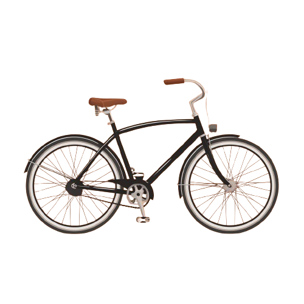
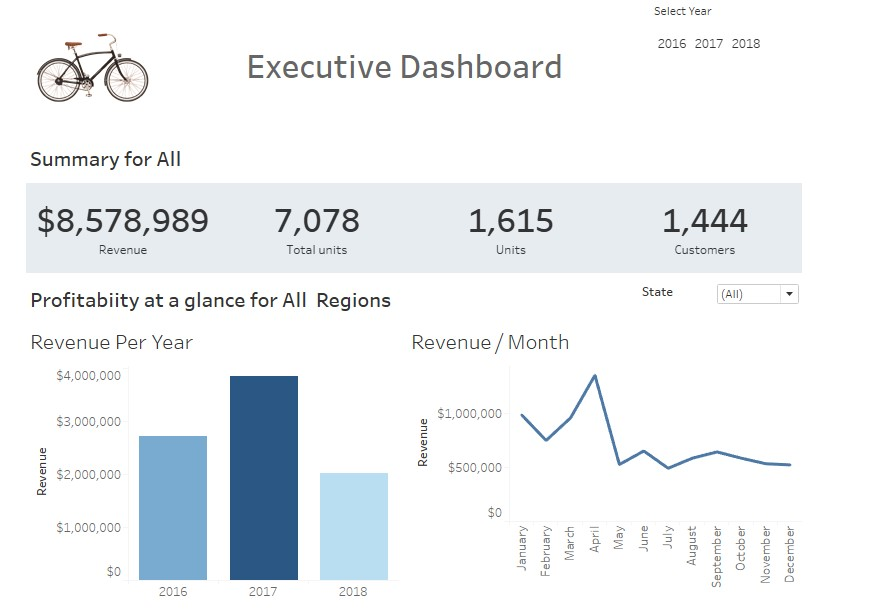
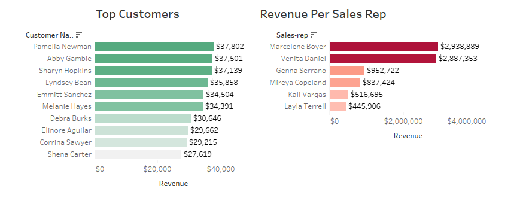

# GearShift

## Introduction

This is a Tableau project on sales analysis of an imaginary store called **Gear Shift**.
The company's management seeks to enhance their understanding of sales performance and identify trends within their sales data from 2016 to 2018. By delving into various dimensions of sales activity, they aim to extract actionable insights to inform strategic decisions and optimize operational efficiency.
**_Disclaimer_**: _All datasets and reports do not represent any company, institution, or country, but just a dummy dataset to demonstrate the capabilities of Tableau._

## Problem Statement
1. Determine annual, monthly, and quarterly revenue trends over the 2016-2018 period.
2. Break down revenue by geographical factors such as state and region.
3. Analyze revenue contributions from different stores, product categories, and brands.
4. Identify top-performing customers based on their purchasing behavior and contribution to revenue.
5. Identify top-performing sales representatives based on their sales performance metrics.

## Skills/ Concepts Demonstrated

The Following SQL queries were used to extract the required data from the database: SELECT, CONCAT, JOIN, GROUP BY

The following Tableau features were implemented: 
- Rank,
- Filter,
- Tooltip,
- Detail

## Visualization:

You can interact with the report [here](https://public.tableau.com/views/GearShiftDashboard/Dashboard1?:language=en-US&publish=yes&:sid=&:display_count=n&:origin=viz_share_link)

Revenue Generated

Top Customers and Sales Reps

